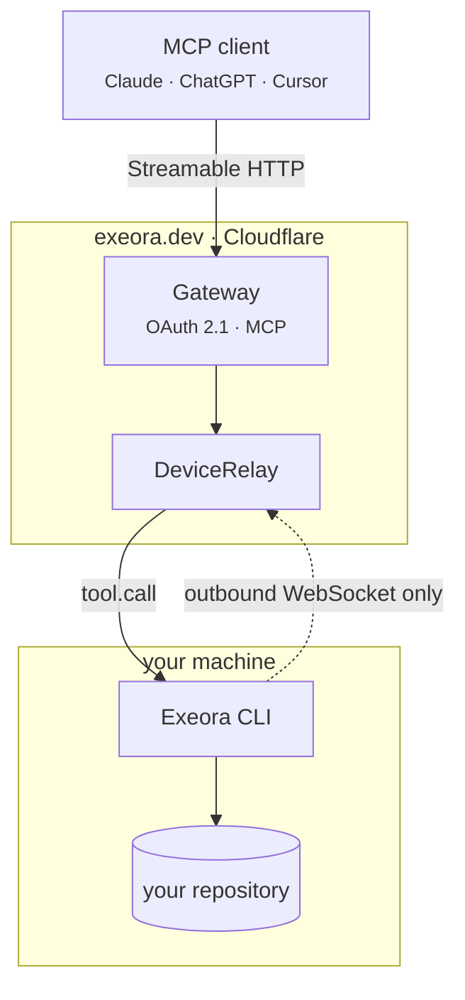

# Exeora

[](./LICENSE)
[](https://www.npmjs.com/package/@exeora/cli)
[](https://github.com/leynier/exeora/actions/workflows/deploy.yml)
[](https://github.com/leynier/exeora)

**Secure execution for AI agents, on any machine.**

Connect Claude, ChatGPT, Cursor, VS Code or Claude Code to a real project on a server, a VM, a build box, a Raspberry Pi, or the laptop in front of you.

No port to open. No source code to upload. No tunnel to wire up.

```bash
cd the-project-you-want-to-serve
npx @exeora/cli connect
```

That one command signs you in, registers the machine, registers the directory, and prints an MCP URL. Point any client at it and leave `connect` running.

**Hosted:** [exeora.dev](https://exeora.dev) · **Docs:** [exeora.dev/docs](https://exeora.dev/docs/) · **npm:** [@exeora/cli](https://www.npmjs.com/package/@exeora/cli)

> **Demo.** Drop a terminal recording at `docs/demo.gif` when you have one (see `docs/demo.gif.placeholder`). Until then, the live product is at [exeora.dev](https://exeora.dev).

---

## Why Exeora

AI agents are only as useful as the environment they can touch. Today you usually pick one of two bad options:

1. **Expose the machine** - open a port, run a tunnel, hope the URL stays private.
2. **Upload the code** - push the repo into a cloud sandbox that is never quite your machine.

Exeora is the third path. The CLI dials **out** to a gateway and holds a WebSocket open. Nothing ever dials in. Your files stay on the machine they already live on. The agent gets ten tools inside one project directory - not a shell on the whole box, and not a copy in someone else's cloud.



## How it works

1. **You run the CLI** in the project directory. It opens an outbound connection to Exeora. No inbound port, no VPN, no ngrok config.
2. **You authorize a client** once. OAuth 2.1 with PKCE. Each project can be its own URL and its own token, so blast radius is a fact about the path, not a promise the model is asked to keep.
3. **The agent works where the code already is** - read, search, edit, run commands - under the policy you set. Revoke the machine from the dashboard and the socket closes immediately.

## Compare

| | **Exeora** | Tunnel (ngrok, Cloudflare Tunnel, …) | Cloud sandbox |
|---|---|---|---|
| Where your code lives | The machine you ran it on | The machine you ran it on | A copy on their infrastructure |
| Inbound port | **None** | None, but a public URL is published | None |
| What is reachable | Ten tools, one project directory | Whatever is listening on that port | A full shell in the copy |
| Per-project isolation | Separate OAuth resource and token | You build it | One sandbox per project |
| Authentication | OAuth 2.1, built in | Whatever your service does | The vendor's account |
| Your real toolchain and state | **Yes** | Yes | Reinstalled, never quite the same |
| Setup | Install, log in, connect | Run the tunnel, then secure it | Push your code |

## What you get

- **No inbound network path** - outbound HTTPS is the only requirement. Home routers, corporate proxies and cloud VMs with no public address all work unconfigured.
- **Your code never leaves the machine** - Exeora routes tool calls; it does not store the repository.
- **A token per endpoint** - a token minted for one project is refused at another. Ownership is checked in the database too.
- **Paths stay in the project** - every path is resolved before anything touches disk. `..` and outward symlinks are rejected.
- **Modes and command rules** - read only, allow list, deny list, per-tool restrictions. Shell metacharacters are refused whenever a list is in force.
- **Confirm before it runs** - optional approval for edits and commands, in the conversation (MCP 2026-07-28) or on the terminal and dashboard.
- **An audit log you can show someone** - which tool ran, how it ended, how long it took. Never the arguments, never the output.
- **Revoke and it stops** - closing a machine kills the live socket that instant, not when a token expires.
- **Bring your own client** - Streamable HTTP, OAuth 2.1, PKCE, dynamic client registration. No plugin, no fork, no lock-in.

## Tools

`read_file` · `list_files` · `grep` · `edit_file` · `write_file` · `run_command` · `start_command` · `get_command_output` · `send_command_input` · `kill_command`

On the account URL, three more for multi-project clients: `list_projects` · `get_active_project` · `set_active_project`.

Both URLs also carry `get_agent_prompt`, which reaches no machine: it hands back Exeora's own coding-agent instructions, for a client that arrived without any. See [the agent prompt](#the-agent-prompt).

Full reference: [exeora.dev/docs/tools](https://exeora.dev/docs/tools/).

## Clients

Works with any MCP client that speaks Streamable HTTP and OAuth, including:

- [Claude](https://claude.ai) / Claude Code
- [ChatGPT](https://chatgpt.com)
- [Cursor](https://cursor.com)
- VS Code MCP
- [MCP Inspector](https://github.com/modelcontextprotocol/inspector)

Setup per client: [exeora.dev/docs/clients](https://exeora.dev/docs/clients/).

## The agent prompt

Claude Code and Cursor arrive knowing how to be a coding agent. claude.ai, ChatGPT and anything you wired up yourself do not, and it shows: they read files to find a symbol, overwrite a file they only half read, and treat a policy refusal as a problem to route around.

So Exeora ships a coding-agent prompt of its own, on four channels, because clients disagree about which they support:

- **`instructions`** in the MCP handshake. A short brief, arriving with nobody asking.
- **The `coding_agent` prompt**, for clients with an MCP prompt menu.
- **The `get_agent_prompt` tool**, for everything else, and for a model that decides to read first.
- **`exeora prompt`**, for whatever is not an MCP client at all.

```bash
exeora prompt > AGENTS.md     # or | pbcopy, or into a system prompt box
exeora prompt --account       # the variant for the account URL
```

It is about Exeora rather than about your codebase, so keep your own `AGENTS.md` exactly as it is. Read it at [exeora.dev/docs/agent-prompt](https://exeora.dev/docs/agent-prompt/).

## Install

**Requires Node 22+.**

```bash
# one-shot (recommended)
cd your-project
npx @exeora/cli connect

# or install globally
npm install -g @exeora/cli
exeora connect
```

Then add the printed URL to your client, for example:

```bash
claude mcp add --transport http exeora <the URL>
```

## Documentation

| | |
|---|---|
| Getting started | [exeora.dev/docs](https://exeora.dev/docs/) |
| Connecting a client | [exeora.dev/docs/clients](https://exeora.dev/docs/clients/) |
| The agent prompt | [exeora.dev/docs/agent-prompt](https://exeora.dev/docs/agent-prompt/) |
| What a project allows | [exeora.dev/docs/policy](https://exeora.dev/docs/policy/) |
| Security model | [exeora.dev/docs/security](https://exeora.dev/docs/security/) |
| Self-hosting | [docs/SELF-HOSTING.md](./docs/SELF-HOSTING.md) · [site guide](https://exeora.dev/docs/self-hosting/) |
| Developing this repo | [CONTRIBUTING.md](./CONTRIBUTING.md) |
| Security reports | [SECURITY.md](./SECURITY.md) |

## Repository layout

| Path | What it is |
|---|---|
| `packages/cli` | The `exeora` binary (`@exeora/cli`) |
| `packages/protocol` | Shared tool contract and relay wire format |
| `packages/design` | Design tokens |
| `apps/gateway` | Cloudflare Worker (OAuth, MCP, relay, API, static site) |
| `apps/web` | Landing, docs and dashboard sources |

## Contributing

See [CONTRIBUTING.md](./CONTRIBUTING.md) for local setup, tests and CLI releases.

Issues and pull requests are welcome. For vulnerabilities, email **hello@exeora.dev** - do not open a public issue.

## Contributors

Thanks to everyone who contributes to Exeora through code, documentation, issues, reviews, and ideas.

See the full list of [contributors](https://github.com/leynier/exeora/graphs/contributors).

## License

[AGPL-3.0-only](./LICENSE).

If you modify Exeora and offer it as a network service, you must offer the corresponding source to the users of that service. Vendored third-party notices for the CLI live in [`packages/cli/LICENSE`](./packages/cli/LICENSE).
