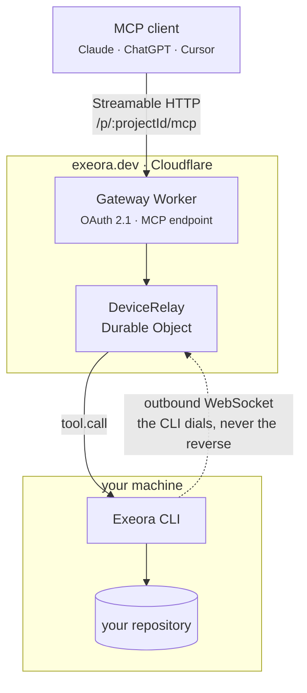

# Exeora

Secure local execution for AI agents.

Connect any MCP client (Claude, ChatGPT, Cursor, VS Code, Claude Code) to the development environment on your own machine, without opening a port, uploading your source code, or wiring up a tunnel.

The CLI dials **out** to the gateway and holds the connection open. Nothing ever dials in, which is why this works behind NAT and corporate firewalls with no configuration.



## Layout

| Path | What it is |
|---|---|
| `packages/protocol` | The tool contract in zod, plus the relay wire format. Imported by both sides, so it exists exactly once. |
| `packages/cli` | The `exeora` binary: login, device and project registration, and the executor that runs tool calls. |
| `apps/gateway` | Cloudflare Worker: OAuth authorization server, MCP endpoint, relay, dashboard API. |
| `apps/web` | Cloudflare Worker: the Astro landing at `/` and the React dashboard at `/dashboard/`. |

Both Workers sit on one zone and are separated by route specificity. The gateway claims `/oauth/*`, `/.well-known/*`, `/p/*` and `/api/*`; everything else falls through to the web Worker.

## Tools

`read_file` · `list_files` · `grep` · `edit_file` · `write_file` · `run_command`

Every path is resolved and confined to the project root before anything touches the disk. See `packages/cli/src/paths.ts`, whose tests are its specification.

**Commands are not filtered in this release, and there is no approval step.** An agent connected to a project can run anything inside that directory on your machine. Connect projects you are comfortable letting an agent change, and revoke a machine from the dashboard the moment you want it to stop.

## Development

Requires Node 22+ and Bun.

```bash
bun install
bun run db:migrate:local     # applies the D1 schema locally
bun run dev                  # gateway on http://localhost:8787
```

Use `bun run dev`, not `wrangler dev` directly. `wrangler dev` takes its origin from the production `routes`, which makes the OAuth issuer report `exeora.dev` while your client is talking to localhost, and a client that validates the issuer (including this CLI) will rightly reject that. The script pins it with `--local-upstream`.

### GitHub sign-in

An OAuth App admits a single callback URL, so development and production need separate apps.

1. Go to <https://github.com/settings/developers> and choose **New OAuth App**.
2. Set the homepage to `http://localhost:8787` and the callback to `http://localhost:8787/oauth/callback/github`.
3. Copy `apps/gateway/.dev.vars.example` to `.dev.vars` and fill in the client id and secret, plus `COOKIE_SECRET` (`openssl rand -hex 32`).

Adding Google later is one new file implementing `UpstreamProvider`, one entry in `apps/gateway/src/oauth/providers/index.ts`, and two secrets. No migration is needed: the `provider` column is plain TEXT and the Drizzle enum is a compile-time constraint only.

### The web app

```bash
cd apps/web
bun run build && bunx wrangler dev --port 8788
```

### Checks

```bash
bun run typecheck
bun run test      # node and workerd projects
bun run check     # Biome
```

The gateway's tests run inside workerd through `@cloudflare/vitest-pool-workers`, so the Durable Object, WebSocket hibernation and D1 are the real implementations rather than stand-ins.

## Trying it end to end

With the gateway running:

```bash
bun run --cwd packages/cli build
export EXEORA_GATEWAY_URL=http://localhost:8787

node packages/cli/bin/index.mjs login          # opens the browser
node packages/cli/bin/index.mjs device register
node packages/cli/bin/index.mjs project add .  # prints the MCP URL
node packages/cli/bin/index.mjs connect        # leave this running
```

Then point a client at the printed URL:

```bash
bunx @modelcontextprotocol/inspector@2.1.0
# or
claude mcp add --transport http exeora <the URL>
```

Stopping `connect` should make the next tool call fail immediately with `LOCAL_EXECUTOR_OFFLINE` rather than hang. Nothing is queued, by design.

## Deploying

```bash
bunx wrangler d1 create exeora             # put the id in apps/gateway/wrangler.jsonc
bunx wrangler kv namespace create OAUTH_KV # likewise

bun run secret GITHUB_CLIENT_ID            # from the production OAuth App
bun run secret GITHUB_CLIENT_SECRET
bun run secret COOKIE_SECRET               # a different value from development

bun run db:migrate
bun run deploy
bun run --cwd apps/web deploy
```

## Design notes

**Nothing is queued.** With no executor connected, a call fails at once with `LOCAL_EXECUTOR_OFFLINE`, and every `tool.call` carries an absolute deadline the executor re-checks on arrival. A command landing hours after it was asked for, when a laptop wakes up, is the hazard this refuses to accept.

**Projects are isolated at the token.** `resourceMetadata.resource` is left unset so the OAuth provider serves RFC 9728 metadata per path: `/p/a/mcp` and `/p/b/mcp` are distinct resources, and a token minted for one is not accepted at the other. Ownership is checked against D1 as well, so there are two independent checks rather than one.

**Hibernation, not `accept()`.** The relay accepts the CLI's socket through the WebSocket Hibernation API. `accept()` bills duration for the whole time a connection is open, which for a machine connected all day is the whole day.

**The audit log records what ran and how it ended, never arguments or output.**

## Not in this release

No billing or plans. No command allowlist and no approval prompts: MCP 2026-07-28's `inputRequired` is the standard mechanism for remote approvals and is already available in the SDK, so that is the natural next step. No long-running processes, since `run_command` is bounded and `start_command`/`get_command_output` need a different, asynchronous shape in the relay. Identity is GitHub only.
