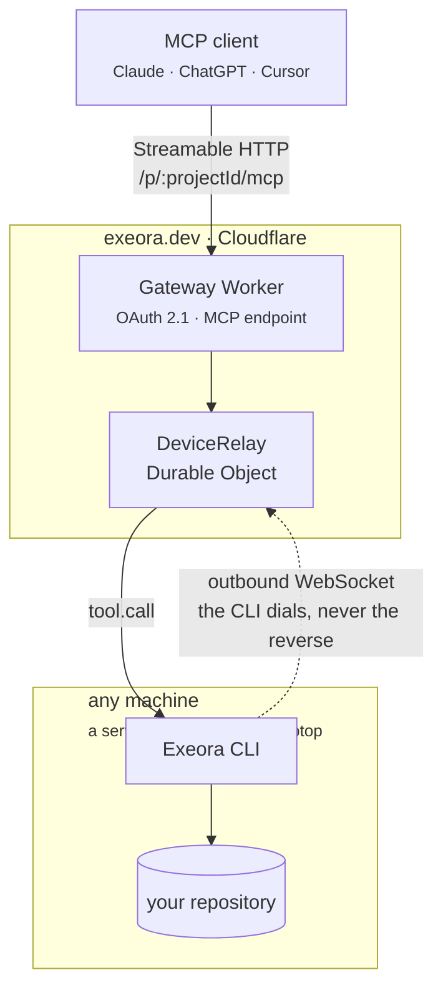

# Exeora

Secure execution for AI agents, on any machine.

Connect any MCP client (Claude, ChatGPT, Cursor, VS Code, Claude Code) to the development environment on any machine you can run a command on: a server, a VM, a build box, a Raspberry Pi, or your own laptop. No port to open, no source code to upload, no tunnel to wire up.

The CLI dials **out** to the gateway and holds the connection open. Nothing ever dials in, which is why the same command works on a laptop behind NAT and on a box behind a corporate firewall, with no configuration on either.



## Layout

| Path | What it is |
|---|---|
| `packages/protocol` | The tool contract in zod, plus the relay wire format. Imported by both sides, so it exists exactly once. |
| `packages/design` | The design tokens, written down once. The landing and dashboard `@import` them into their Tailwind build; the gateway imports the same file as text and inlines it into the OAuth screens. |
| `packages/cli` | The `exeora` binary: login, device and project registration, and the executor that runs tool calls. |
| `apps/gateway` | The Worker: OAuth authorization server, MCP endpoint, relay, dashboard API, and the static site. |
| `apps/web` | Sources for the Astro landing at `/` and the React dashboard at `/dashboard/`. Built here, served by the gateway. |

One Worker owns the whole hostname. The site was briefly a Worker of its own, until it turned out neither half needs a server: Astro emits static HTML and the dashboard is a Vite bundle, so an `ASSETS` binding is enough.

## Tools

`read_file` · `list_files` · `grep` · `edit_file` · `write_file` · `run_command`

Every path is resolved and confined to the project root before anything touches the disk. See `packages/cli/src/paths.ts`, whose tests are its specification.

**Commands are not filtered in this release, and there is no approval step.** An agent connected to a project can run anything inside that directory on whichever machine is serving it. Connect projects you are comfortable letting an agent change, and revoke a machine from the dashboard the moment you want it to stop.

## Install

```bash
npm install -g @exeora/cli
exeora login
exeora project add .
exeora connect
```

Published from `packages/cli` as [`@exeora/cli`](https://www.npmjs.com/package/@exeora/cli), which is why that directory has a readme and a license of its own. Node 22+.

Scoped because npm refuses the bare name: its spam filter rejects `exeora` as too close to `execa`, which happens to be one of this CLI's own dependencies. Every name of that shape is blocked the same way, `exeora-cli` included, since `execa-cli` exists too. Scoped names skip the check. The command is still `exeora`, since that comes from `bin` rather than from the package name.

## Development

Requires Node 22+ and Bun.

```bash
bun install
bun run db:migrate:local     # applies the D1 schema locally
bun run dev                  # everything on http://localhost:8787
```

`dev` builds the landing and dashboard first. Wrangler refuses to start when the directory behind the `ASSETS` binding does not exist, so skipping that step fails outright rather than serving an empty site.

Use `bun run dev`, not `wrangler dev` directly. `wrangler dev` takes its origin from the production `routes`, which makes the OAuth issuer report `exeora.dev` while your client is talking to localhost, and a client that validates the issuer (including this CLI) will rightly reject that. The script pins it with `--local-upstream`.

### GitHub sign-in

An OAuth App admits a single callback URL, so development and production need separate apps.

1. Go to <https://github.com/settings/developers> and choose **New OAuth App**.
2. Set the homepage to `http://localhost:8787` and the callback to `http://localhost:8787/oauth/callback/github`.
3. Copy `apps/gateway/.dev.vars.example` to `.dev.vars` and fill in the client id and secret, plus `COOKIE_SECRET` (`openssl rand -hex 32`).

Adding Google later is one new file implementing `UpstreamProvider`, one entry in `apps/gateway/src/oauth/providers/index.ts`, and two secrets. No migration is needed: the `provider` column is plain TEXT and the Drizzle enum is a compile-time constraint only.

### Working on the dashboard

```bash
bun run --cwd apps/web dev:dashboard   # Vite, proxying /api and /oauth to :8787
```

### Checks

```bash
bun run typecheck
bun run test      # node and workerd projects
bun run check     # Biome
```

The gateway's tests run inside workerd through `@cloudflare/vitest-pool-workers`, so the Durable Object, WebSocket hibernation and D1 are the real implementations rather than stand-ins.

## Trying it end to end

With the gateway running:

```bash
bun run --cwd packages/cli build
export EXEORA_GATEWAY_URL=http://localhost:8787

node packages/cli/bin/index.mjs login          # opens the browser
node packages/cli/bin/index.mjs device register
node packages/cli/bin/index.mjs project add .  # prints the MCP URL
node packages/cli/bin/index.mjs connect        # leave this running
```

Then point a client at the printed URL:

```bash
bunx @modelcontextprotocol/inspector@2.1.0
# or
claude mcp add --transport http exeora <the URL>
```

Stopping `connect` should make the next tool call fail immediately with `LOCAL_EXECUTOR_OFFLINE` rather than hang. Nothing is queued, by design.

## Deploying

Every push to `main` runs CI and, if it passes, applies the D1 migrations, builds the site and deploys the Worker (`.github/workflows/deploy.yml`). `workflow_dispatch` triggers the same run by hand.

### One-time setup

**1. Create the resources** and put their ids in `apps/gateway/wrangler.jsonc`, replacing the two `REPLACE_WITH_*` placeholders. Ids are not secrets.

```bash
bunx wrangler d1 create exeora
bunx wrangler kv namespace create OAUTH_KV
```

**2. Create a production GitHub OAuth App.** An OAuth App admits one callback URL, so this has to be separate from the development one: homepage `https://exeora.dev`, callback `https://exeora.dev/oauth/callback/github`.

**3. Create a Cloudflare API token** at <https://dash.cloudflare.com/profile/api-tokens>. The OAuth credentials wrangler uses locally are not usable from CI. It needs:

| Scope | Permission |
|---|---|
| Account · Workers Scripts | Edit |
| Account · Workers KV Storage | Edit |
| Account · D1 | Edit |
| Zone · Workers Routes | Edit (on `exeora.dev`) |

The hostname also needs a proxied DNS record, or Cloudflare never routes it to the Worker. A single `AAAA` on `@` pointing at `100::` with the proxy on is enough; nothing ever connects to that address.

**4. Add the repository secrets** under Settings → Secrets and variables → Actions:

| Secret | Value |
|---|---|
| `CLOUDFLARE_API_TOKEN` | the token from step 3 |
| `CLOUDFLARE_ACCOUNT_ID` | the account owning the `exeora.dev` zone |
| `GH_OAUTH_CLIENT_ID` | client id from step 2 |
| `GH_OAUTH_CLIENT_SECRET` | client secret from step 2 |
| `COOKIE_SECRET` | `openssl rand -hex 32`, different from development |

The GitHub ones are named `GH_OAUTH_*` because GitHub refuses repository secrets whose name begins with `GITHUB_`. The workflow renames them to the `GITHUB_CLIENT_ID` and `GITHUB_CLIENT_SECRET` the Worker actually reads.

### Deploying by hand

```bash
bun run secret GITHUB_CLIENT_ID
bun run secret GITHUB_CLIENT_SECRET
bun run secret COOKIE_SECRET

bun run db:migrate
bun run deploy      # builds the site, then deploys the Worker
```

## Releasing the CLI

```bash
cd packages/cli && npm version patch --workspaces=false
git commit -am "release: cli v0.1.1" && git tag cli-v0.1.1
git push && git push --tags
```

The tag triggers `.github/workflows/release-cli.yml`, which runs the same CI, checks that the tag agrees with `package.json`, builds, and publishes to npm. Authentication is npm trusted publishing over OIDC, so there is no token in the repository secrets; the trusted publisher is configured on the package's page on npmjs.com and points at this workflow.

No provenance attestation: npm only generates one when the source repository is public, and this one is not. The published manifest carries no `repository` field for the same reason, since a link nobody can open is worse than no link. Everything points at `https://exeora.dev` instead.

Releases are deliberately not tied to `main`: the gateway deploys on every push, the CLI ships when a tag says so.

**Bumping `PROTOCOL_VERSION` breaks every installed CLI** until people upgrade, because the relay rejects a mismatch outright (`packages/protocol/src/messages.ts`, `apps/gateway/src/relay-do.ts`). Merge first so the gateway deploys, then tag, never the other way around.

The CLI's version lives in `packages/cli/package.json` and nowhere else. tsdown substitutes it into the bundle, and `packages/cli/src/version.ts` reports `0.0.0-dev` when the sources are run directly.

## License

`packages/cli` is MIT, since it is the part that gets installed on other people's machines. The rest of this repository is not licensed for reuse.

## Design notes

**Nothing is queued.** With no executor connected, a call fails at once with `LOCAL_EXECUTOR_OFFLINE`, and every `tool.call` carries an absolute deadline the executor re-checks on arrival. A command landing hours after it was asked for, when a laptop wakes up, is the hazard this refuses to accept.

**Projects are isolated at the token.** `resourceMetadata.resource` is left unset so the OAuth provider serves RFC 9728 metadata per path: `/p/a/mcp` and `/p/b/mcp` are distinct resources, and a token minted for one is not accepted at the other. Ownership is checked against D1 as well, so there are two independent checks rather than one.

**Hibernation, not `accept()`.** The relay accepts the CLI's socket through the WebSocket Hibernation API. `accept()` bills duration for the whole time a connection is open, which for a machine connected all day is the whole day.

**The audit log records what ran and how it ended, never arguments or output.**

**`packages/cli/src/tools/vendor/` is copied, not imported.** The edit matching and the truncation come from pi-coding-agent, which is MIT and better at both than a first attempt would be. Depending on it cost 172 MB of the 189 MB an install weighed, because its published tools are built for a terminal and pulled in a syntax highlighter, a wasm image resizer and an agent runtime to render output Exeora throws away. Taking the two pure modules brought the install to 18 MB. The origin and its license are recorded in `packages/cli/LICENSE`.

## Not in this release

No billing or plans. No command allowlist and no approval prompts: MCP 2026-07-28's `inputRequired` is the standard mechanism for remote approvals and is already available in the SDK, so that is the natural next step. No long-running processes, since `run_command` is bounded and `start_command`/`get_command_output` need a different, asynchronous shape in the relay. Identity is GitHub only.
