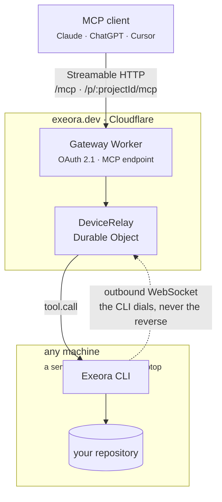

# Exeora

Secure execution for AI agents, on any machine.

Connect any MCP client (Claude, ChatGPT, Cursor, VS Code, Claude Code) to the development environment on any machine you can run a command on: a server, a VM, a build box, a Raspberry Pi, or your own laptop. No port to open, no source code to upload, no tunnel to wire up.

The CLI dials **out** to the gateway and holds the connection open. Nothing ever dials in, which is why the same command works on a laptop behind NAT and on a box behind a corporate firewall, with no configuration on either.



## Layout

| Path | What it is |
|---|---|
| `packages/protocol` | The tool contract in zod, plus the relay wire format. Imported by both sides, so it exists exactly once. |
| `packages/design` | The design tokens, written down once. The landing and dashboard `@import` them into their Tailwind build; the gateway imports the same file as text and inlines it into the OAuth screens. |
| `packages/cli` | The `exeora` binary: login, device and project registration, and the executor that runs tool calls. |
| `apps/gateway` | The Worker: OAuth authorization server, MCP endpoint, relay, dashboard API, and the static site. |
| `apps/web` | Sources for the Astro landing at `/`, the docs at `/docs/`, and the React dashboard at `/dashboard/`. Built here, served by the gateway. |

The documentation lives at `apps/web/landing/src/pages/docs/`, with its order and sidebar in `apps/web/landing/src/lib/docs.ts`. The tool reference is generated from `TOOL_DEFINITIONS` at build time through `toolFields()`, so adding a tool publishes its reference and none of it can go quietly out of date.

One Worker owns the whole hostname. The site was briefly a Worker of its own, until it turned out neither half needs a server: Astro emits static HTML and the dashboard is a Vite bundle, so an `ASSETS` binding is enough.

## Two URLs

`https://exeora.dev/p/:projectId/mcp` is one project and nothing else. The id is in the path and lives in the handler's closure, never in anything the client sends, so an agent connected to one project has no way to name another: the separation is structural rather than something the model is asked to respect. The cost is one entry per project in every client.

`https://exeora.dev/mcp` is the same URL for everyone and covers several projects at once. Authorizing a client on it shows a consent screen listing your projects, you tick the ones it may reach, and **those ticks are the access list**: what is left unticked is taken away, and it can be changed later from the dashboard. The client then moves between them itself with `list_projects` and `set_active_project`, and the ten tools take an optional `project` to run one call elsewhere without moving. Add it once and it keeps working as projects come and go.

The second URL is the weaker guarantee, and it is weaker in exactly one place: which of the projects you ticked a call lands in is state the agent can change, not a fact about the URL. Ticking one project gives you back the first URL's reach. Both go through the same policy, the same confirmations and the same audit log once the project is known, and the two are separate consents, so a client authorized both ways keeps whichever you do not take away.

The active project is one per client rather than one per conversation, because the endpoint is stateless and the clients most people use carry nothing between requests. Two conversations open in the same client therefore share it and can move each other; the `project` argument is the way out of that for a single call.

## Tools

`read_file` · `list_files` · `grep` · `edit_file` · `write_file` · `run_command` · `start_command` · `get_command_output` · `send_command_input` · `kill_command`

On the account URL, three more: `list_projects` · `get_active_project` · `set_active_project`. They are answered by the gateway and never reach a machine, which is why they are a registry of their own in `packages/protocol` rather than three more entries in `TOOL_DEFINITIONS`: the executor announces that list and can run none of these, and the command policy is defined over it.

Every path is resolved and confined to the project root before anything touches the disk. See `packages/cli/src/paths.ts`, whose tests are its specification.

A project can be set to confirm every change before it runs, in the client, on the machine's terminal or in the dashboard depending on what the client can do; see below. Connect projects you are comfortable letting an agent change, and revoke a machine from the dashboard the moment you want it to stop.

## What a project allows

A new project allows everything, which is what every project did before the setting existed. From the dashboard it can be set to `read_only`, which refuses every tool that changes anything, or to `allow_list`, which names the commands `run_command` may invoke. Independently of the mode, `deny` names commands that are never run, and `tools` names which tools exist here at all.

**A list refuses shell syntax by default, and that is the whole reason it is worth anything.** Commands run through a shell, so `npm test; rm -rf ~` is one command whose first word is `npm`: a list compared against the first word and nothing else would let it through. Whenever a list is in force, which means `allow_list` or any project with a `deny` list, anything carrying a shell metacharacter is refused outright unless the project sets `shell = true`, which turns both lists back into suggestions and says so in the dashboard.

### Rules

Each entry in `allow` and `deny` is a rule, matched against the words of the command:

| Rule | Permits | Does not permit |
|---|---|---|
| `npm` | `npm`, `npm test`, `npm run build -- --watch` | `npx test` |
| `git push` | `git push` | `git push --force`, `git status` |
| `git *` | `git`, `git push origin main` | `gitk` |
| `cargo build *` | `cargo build`, `cargo build --release` | `cargo test` |

**A single word still means the program and any arguments**, which is what a one-word entry meant before rules could be longer; changing that would have quietly tightened every list already written. It is not a glob: `*` is honoured as the final word and nowhere else, since a syntax that resembles a glob without being one gets misread rather than learned.

`deny` is checked before `allow` and applies in every mode, which is the only reason it is worth having: `allow_list` already refuses everything it does not name, so the sentence only `allow_all` can express is "anything, except `sudo`".

### Which tools exist

`tools` is the granularity the modes cannot express. `read_only` is the only per-tool statement a mode makes, and it is all or nothing; naming tools is how a project says "edit files, never run a command". Unset means every tool, including any added later, so a project that never restricted its tools does not silently refuse the next one to exist.

The policy is checked twice, on purpose. The gateway checks it because it is the only side holding the account's setting, and because an older CLI would ignore a field it does not know. The executor checks it because it is the authority on the machine, and the only side that can read a project's own file. Both run the same functions from `packages/protocol/src/policy.ts`, whose tests are its specification.

### `exeora.toml`

A project may carry one in its root. It can only narrow what the account allows, never widen it, so whoever controls a machine can restrict an agent further and cannot grant themselves anything.

```toml
mode = "allow_list"                  # allow_all | allow_list | read_only
allow = ["npm", "git *"]
deny = ["sudo", "rm *"]
shell = false
approve = true
tools = ["read_file", "grep", "run_command"]
```

Every key is optional, and leaving one out means the file has no opinion about it rather than asking for the strictest value.

Narrowing runs per field, each in its own direction: the stricter mode wins, `allow` and `tools` intersect, `deny` unites, and `shell` survives only if both sides permit it. `deny` uniting where `allow` intersects is the same rule seen from the other end, since refusing is the strict direction: a machine may refuse something the account never thought to mention, and may not un-refuse anything. A file that cannot be parsed is reported on the terminal and ignored: refusing every call over a typo would stop a project dead, and ignoring it silently would remove a restriction someone believed they had.

## Confirming a call before it runs

`approve` asks the person before anything that edits, writes or runs, naming the file or quoting the command. Reads are never interrupted: a prompt nobody can decline is one people learn to click through.

Who gets asked depends on the client:

**A client speaking MCP 2026-07-28** is asked in the conversation the call came from, which is the best place for it. The endpoint is stateless, so the two halves of an approved call are joined by the `requestState` string that revision round-trips through the client. That string comes back as attacker-controlled input and the SDK verifies nothing by default, so it is HMAC signed with `REQUEST_STATE_SECRET` through the SDK's own `createRequestStateCodec`, bound to the calling client, and **carries a hash of the arguments**. Without that last part a client could have `ls` confirmed and retry with `rm -rf ~` under the same approval: the signature would verify and the tool would match. See `apps/gateway/src/approval.ts`.

**Everyone else**, which today includes claude.ai and ChatGPT, is asked out of band: the terminal running `exeora connect`, if that machine has one, and the Exeora dashboard, at the same time. The first answer wins and the other side is told the question is over rather than left holding a prompt that no longer does anything. Nobody answering within ninety seconds refuses the call, since an unattended machine should fail rather than hang.

That second path carries no signature and no hash of the arguments, and does not need either: the question never leaves the relay, which holds the arguments itself for the whole exchange. There is nothing in flight to forge. It is the structurally safer of the two, and it exists because the first one reaches almost nobody today.

## Install

```bash
cd the-project-you-want-to-serve
npx @exeora/cli connect
```

`connect` signs in, registers the machine and registers the directory, skipping whichever of those is already done, then serves until you stop it.

Published from `packages/cli` as [`@exeora/cli`](https://www.npmjs.com/package/@exeora/cli), which is why that directory has a readme and a license of its own. Node 22+.

Scoped because npm refuses the bare name: its spam filter rejects `exeora` as too close to `execa`, which happens to be one of this CLI's own dependencies. Every name of that shape is blocked the same way, `exeora-cli` included, since `execa-cli` exists too. Scoped names skip the check. The command is still `exeora`, since that comes from `bin` rather than from the package name.

## Development

Requires Node 22+ and Bun.

```bash
bun install
bun run db:migrate:local     # applies the D1 schema locally
bun run dev                  # everything on http://localhost:8787
```

`dev` builds the landing and dashboard first. Wrangler refuses to start when the directory behind the `ASSETS` binding does not exist, so skipping that step fails outright rather than serving an empty site.

Use `bun run dev`, not `wrangler dev` directly. `wrangler dev` takes its origin from the production `routes`, which makes the OAuth issuer report `exeora.dev` while your client is talking to localhost, and a client that validates the issuer (including this CLI) will rightly reject that. The script pins it with `--local-upstream`.

### GitHub sign-in

An OAuth App admits a single callback URL, so development and production need separate apps.

1. Go to <https://github.com/settings/developers> and choose **New OAuth App**.
2. Set the homepage to `http://localhost:8787` and the callback to `http://localhost:8787/oauth/callback/github`.
3. Copy `apps/gateway/.dev.vars.example` to `.dev.vars` and fill in the client id and secret, plus `COOKIE_SECRET` and `REQUEST_STATE_SECRET` (`openssl rand -hex 32` each).

Adding Google later is one new file implementing `UpstreamProvider`, one entry in `apps/gateway/src/oauth/providers/index.ts`, and two secrets. No migration is needed: the `provider` column is plain TEXT and the Drizzle enum is a compile-time constraint only.

### Working on the dashboard

```bash
bun run --cwd apps/web dev:dashboard   # Vite, proxying /api and /oauth to :8787
```

### Checks

```bash
bun run typecheck
bun run test      # node and workerd projects
bun run check     # Biome
```

The gateway's tests run inside workerd through `@cloudflare/vitest-pool-workers`, so the Durable Object, WebSocket hibernation and D1 are the real implementations rather than stand-ins.

## Trying it end to end

With the gateway running:

```bash
bun run --cwd packages/cli build
export EXEORA_GATEWAY_URL=http://localhost:8787

# connect signs in, registers the machine and registers the directory,
# skipping whichever of those is already done.
node packages/cli/bin/index.mjs connect
```

Then point a client at the printed URL:

```bash
bunx @modelcontextprotocol/inspector@2.1.0
# or
claude mcp add --transport http exeora <the URL>
```

Stopping `connect` should make the next tool call fail immediately with `LOCAL_EXECUTOR_OFFLINE` rather than hang. Nothing is queued, by design.

## Deploying

Every push to `main` runs CI and, if it passes, applies the D1 migrations, builds the site and deploys the Worker (`.github/workflows/deploy.yml`). `workflow_dispatch` triggers the same run by hand.

### One-time setup

**1. Create the resources** and put their ids in `apps/gateway/wrangler.jsonc`, replacing the two `REPLACE_WITH_*` placeholders. Ids are not secrets.

```bash
bunx wrangler d1 create exeora
bunx wrangler kv namespace create OAUTH_KV
```

**2. Create a production GitHub OAuth App.** An OAuth App admits one callback URL, so this has to be separate from the development one: homepage `https://exeora.dev`, callback `https://exeora.dev/oauth/callback/github`.

**3. Create a Cloudflare API token** at <https://dash.cloudflare.com/profile/api-tokens>. The OAuth credentials wrangler uses locally are not usable from CI. It needs:

| Scope | Permission |
|---|---|
| Account · Workers Scripts | Edit |
| Account · Workers KV Storage | Edit |
| Account · D1 | Edit |
| Zone · Workers Routes | Edit (on `exeora.dev`) |

The hostname also needs a proxied DNS record, or Cloudflare never routes it to the Worker. A single `AAAA` on `@` pointing at `100::` with the proxy on is enough; nothing ever connects to that address.

**4. Add the repository secrets** under Settings → Secrets and variables → Actions:

| Secret | Value |
|---|---|
| `CLOUDFLARE_API_TOKEN` | the token from step 3 |
| `CLOUDFLARE_ACCOUNT_ID` | the account owning the `exeora.dev` zone |
| `GH_OAUTH_CLIENT_ID` | client id from step 2 |
| `GH_OAUTH_CLIENT_SECRET` | client secret from step 2 |
| `COOKIE_SECRET` | `openssl rand -hex 32`, different from development |
| `REQUEST_STATE_SECRET` | `openssl rand -hex 32`, different again: it signs the approvals that travel through an AI client |

The GitHub ones are named `GH_OAUTH_*` because GitHub refuses repository secrets whose name begins with `GITHUB_`. The workflow renames them to the `GITHUB_CLIENT_ID` and `GITHUB_CLIENT_SECRET` the Worker actually reads.

### Deploying by hand

```bash
bun run secret GITHUB_CLIENT_ID
bun run secret GITHUB_CLIENT_SECRET
bun run secret COOKIE_SECRET
bun run secret REQUEST_STATE_SECRET

bun run db:migrate
bun run deploy      # builds the site, then deploys the Worker
```

## Releasing the CLI

```bash
cd packages/cli && npm version patch --workspaces=false
git commit -am "release: cli v0.1.1" && git tag cli-v0.1.1
git push && git push --tags
```

The tag triggers `.github/workflows/release-cli.yml`, which runs the same CI, checks that the tag agrees with `package.json`, builds, and publishes to npm. Authentication is npm trusted publishing over OIDC, so there is no token in the repository secrets; the trusted publisher is configured on the package's page on npmjs.com and points at this workflow.

No provenance attestation: npm only generates one when the source repository is public, and this one is not. The published manifest carries no `repository` field for the same reason, since a link nobody can open is worse than no link. Everything points at `https://exeora.dev` instead.

Releases are deliberately not tied to `main`: the gateway deploys on every push, the CLI ships when a tag says so.

Set `LATEST_CLI_VERSION` in `apps/gateway/wrangler.jsonc` to the version being published. The gateway tells it to every executor in the `hello.ack`, and `connect` prints a line when a newer one exists. It is told rather than looked up so connecting never depends on the npm registry being reachable.

**Adding to the protocol does not break installed CLIs.** The relay serves the range `MIN_SUPPORTED_PROTOCOL_VERSION` to `PROTOCOL_VERSION`, and anything a newer CLI gained is negotiated: the executor announces `capabilities` in its `hello`, and the gateway advertises only the tools it named. Raise `MIN_SUPPORTED_PROTOCOL_VERSION` only for a change an old CLI would get actively *wrong*, as opposed to one it would merely not have, and expect that to disconnect everyone below it. Merge first so the gateway deploys, then tag, never the other way around.

The CLI's version lives in `packages/cli/package.json` and nowhere else. tsdown substitutes it into the bundle, and `packages/cli/src/version.ts` reports `0.0.0-dev` when the sources are run directly.

## License

`packages/cli` is MIT, since it is the part that gets installed on other people's machines. The rest of this repository is not licensed for reuse.

## Design notes

**Nothing is queued.** With no executor connected, a call fails at once with `LOCAL_EXECUTOR_OFFLINE`, and every `tool.call` carries an absolute deadline the executor re-checks on arrival. A command landing hours after it was asked for, when a laptop wakes up, is the hazard this refuses to accept.

**A call nobody is waiting for is stopped, not left running.** When the MCP client hangs up, the relay's own deadline expires, or the executor's socket drops, the CLI kills the command's whole process group. The alternative is a `run_command` that keeps working for its full five minutes with no one left to read the answer, which is the same hazard as a call that lands late, arriving from the other end. `start_command` follows the same rule from further away: a process it started dies when the connection does, because a dev server nobody can reach, read or stop is not a feature.

**Projects are isolated at the token.** `resourceMetadata.resource` is left unset so the OAuth provider serves RFC 9728 metadata per path: `/p/a/mcp` and `/p/b/mcp` are distinct resources, and a token minted for one is not accepted at the other. Ownership is checked against D1 as well, so there are two independent checks rather than one.

**Hibernation, not `accept()`.** The relay accepts the CLI's socket through the WebSocket Hibernation API. `accept()` bills duration for the whole time a connection is open, which for a machine connected all day is the whole day.

**The audit log records what ran and how it ended, never arguments or output.** It is kept for 90 days and pruned by a nightly cron, which also lets the OAuth provider drop expired grants. Nothing else bounds that table: one row per tool call, and an agent reading its way through a repository writes hundreds a minute.

**`packages/cli/src/tools/vendor/` is copied, not imported.** The edit matching and the truncation come from pi-coding-agent, which is MIT and better at both than a first attempt would be. Depending on it cost 172 MB of the 189 MB an install weighed, because its published tools are built for a terminal and pulled in a syntax highlighter, a wasm image resizer and an agent runtime to render output Exeora throws away. Taking the two pure modules brought the install to 18 MB. The origin and its license are recorded in `packages/cli/LICENSE`.

**`@cloudflare/workers-oauth-provider` is patched, and the patch is why ChatGPT can connect.** Its Client ID Metadata Document support read `token_endpoint_auth_method` as a requirement rather than a preference, so a document declaring `private_key_jwt` was refused even when it advertised `none` alongside it in `token_endpoint_auth_methods_supported`. That is the document ChatGPT publishes, and the refusal reached the user as an error page on `/oauth/authorize`. `patches/@cloudflare%2Fworkers-oauth-provider@0.10.1.patch` makes the two fields negotiate: the declared method is kept when the gateway implements it, and otherwise the first mutually supported one is chosen. A CIMD client still cannot end up with anything but `none`, which is the only method available to a client the gateway never issued a secret to. Reported as [cloudflare/workers-oauth-provider#293](https://github.com/cloudflare/workers-oauth-provider/issues/293) with the same fix offered as [#294](https://github.com/cloudflare/workers-oauth-provider/pull/294); drop the patch once a release carries it. `apps/gateway/src/oauth/cimd.workers.test.ts` fails if it goes missing before then.

## Not in this release

No billing or plans: nothing is metered and nothing is charged, and the rate limiting in `wrangler.jsonc` stops a caller hammering the gateway rather than enforcing a quota. Long-running processes exist but die with the connection, so a dev server does not survive a dropped socket. Identity is GitHub only. Deploys go straight to production; there is no staging environment.
