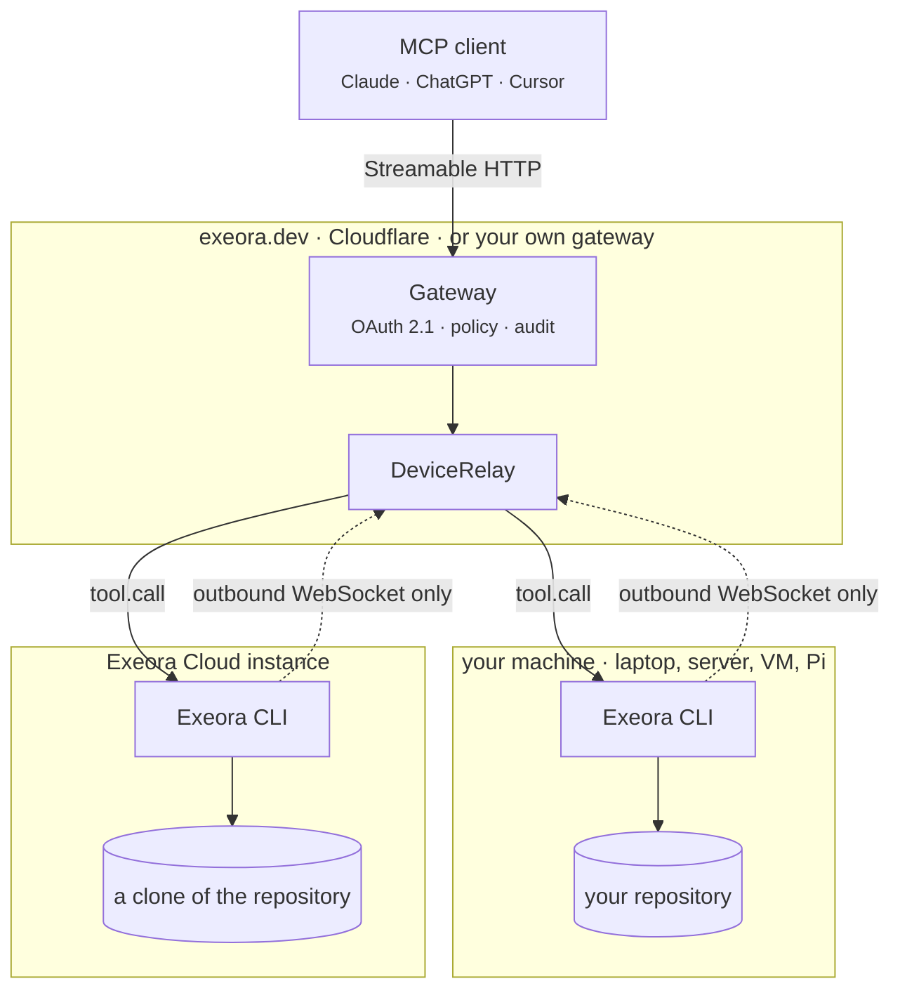

<p align="center">
  <a href="https://exeora.dev">
    <picture>
      <source media="(prefers-color-scheme: dark)" srcset="./apps/web/landing/public/brand/exeora-wordmark-light.svg">
      
    </picture>
  </a>
</p>

<p align="center"><strong>Let your AI work where your code already runs.</strong></p>

<p align="center">
  <a href="./LICENSE"></a>
  <a href="https://github.com/leynier/exeora/actions/workflows/ci.yml"></a>
  <a href="https://github.com/leynier/exeora/actions/workflows/deploy.yml"></a>
  <a href="https://github.com/leynier/exeora"></a>
</p>

<p align="center">
  <a href="https://exeora.dev">Website</a> ·
  <a href="https://exeora.dev/docs/">Docs</a> ·
  <a href="https://exeora.dev/dashboard/">Dashboard</a> ·
  <a href="https://github.com/leynier/exeora/releases/latest">CLI releases</a> ·
  <a href="https://exeora.dev/docs/self-hosting/">Self-hosting</a>
</p>

---

Exeora turns a project on a server, a VM, a build box, a Raspberry Pi, the laptop in front of you, or Exeora Cloud into one MCP URL. Claude, ChatGPT, Cursor, VS Code, Copilot and every other MCP client can then read, edit and run it right there, under rules you set.

No port to open. No source code to upload. No tunnel to wire up. Free for 10 machines and 2 Cloud instances.

```bash
curl -fsSL https://exeora.dev/linux/install.sh | sh
exeora connect
exeora project add the-project-you-want-to-serve
```

`connect` signs you in, registers the machine, and keeps the outbound connection open. It does not have to be run from a project directory. `exeora project add` registers a directory to serve. Point any client at the printed MCP URL and leave `connect` running.

A project is a repository, and it lives in one or more locations: your machines and Exeora Cloud. One location is the default, where a call that names no workspace lands. Running `exeora project add` in a checkout whose remote is already a project joins that project as one more location. With GitHub connected in the dashboard, a project can also be added by picking a repository from a list and letting [Exeora Cloud](#exeora-cloud) hold it, with no machine of yours switched on. See [projects, locations and workspaces](https://exeora.dev/docs/projects/).

**Contents:** [Why Exeora](#why-exeora) · [How it works](#how-it-works) · [Compare](#compare) · [What you get](#what-you-get) · [Tools](#tools) · [Beyond tool calls](#beyond-tool-calls) · [Clients](#clients) · [Install](#install) · [Plans](#plans) · [Documentation](#documentation) · [Contributing](#contributing)

---

## Why Exeora

AI agents are only as useful as the environment they can touch. Today you usually pick one of two bad options:

1. **Expose the machine** - open a port, run a tunnel, hope the URL stays private.
2. **Upload the code** - push the repo into a cloud sandbox that is never quite your machine.

Exeora is the third path. The CLI dials **out** to a gateway and holds a WebSocket open. Nothing ever dials in. Your files stay on the machine they already live on. The agent gets seventeen tools inside one project directory - not a shell on the whole box, and not a copy in someone else's cloud.


```mermaid
flowchart TD
    client["MCP client<br/><small>Claude · ChatGPT · Cursor</small>"]

    subgraph cloud["exeora.dev · Cloudflare · or your own gateway"]
        gateway["Gateway<br/><small>OAuth 2.1 · policy · audit</small>"]
        relay["DeviceRelay"]
    end

    subgraph machine["your machine · laptop, server, VM, Pi"]
        cli["Exeora CLI"]
        repo[("your repository")]
    end

    subgraph instance["Exeora Cloud instance"]
        cloudcli["Exeora CLI"]
        clone[("a clone of the repository")]
    end

    client -->|"Streamable HTTP"| gateway
    gateway --> relay
    cli -.->|"outbound WebSocket only"| relay
    cloudcli -.->|"outbound WebSocket only"| relay
    relay -->|"tool.call"| cli
    relay -->|"tool.call"| cloudcli
    cli --> repo
    cloudcli --> clone
```

## How it works

1. **You run the CLI** on the machine. It opens an outbound connection to Exeora. No inbound port, no VPN, no ngrok config. Add each directory you want to serve with `exeora project add`.
2. **You authorize a client** once. OAuth 2.1 with PKCE. Each project can be its own URL and its own token, so blast radius is a fact about the path, not a promise the model is asked to keep.
3. **The agent works where the code already is** - read, search, edit, run commands - under the policy you set. Revoke the machine from the dashboard and the socket closes immediately.

## Compare

| | **Exeora** | Tunnel (ngrok, Cloudflare Tunnel, …) | Cloud sandbox |
|---|---|---|---|
| Where your code lives | The machine you ran it on | The machine you ran it on | A copy on their infrastructure |
| Inbound port | **None** | None, but a public URL is published | None |
| What is reachable | Seventeen tools, confined to the project | Whatever is listening on that port | A full shell in the copy |
| Per-project isolation | Separate OAuth resource and token | You build it | One sandbox per project |
| Authentication | OAuth 2.1, built in | Whatever your service does | The vendor's account |
| Your real toolchain and state | **Yes** | Yes | Reinstalled, never quite the same |
| Setup | Install, log in, connect | Run the tunnel, then secure it | Push your code |

## What you get

- **No inbound network path** - outbound HTTPS is the only requirement. Home routers, corporate proxies and cloud VMs with no public address all work unconfigured.
- **Your code stays where you put it** - on a machine of yours, Exeora routes tool calls and does not store the repository. Exeora Cloud holds a clone only of a project you put there.
- **A token per endpoint** - a token minted for one project is refused at another. Ownership is checked in the database too.
- **Paths stay in the project** - every path is resolved before anything touches disk. `..` and outward symlinks are rejected.
- **Modes and command rules** - read only, allow list, deny list, per-tool restrictions. Shell metacharacters are refused whenever a list is in force.
- **Confirm before it runs** - optional approval for edits and commands, in the conversation (MCP 2026-07-28) or on the terminal and dashboard.
- **An audit log you can show someone** - which tool ran, how it ended, how long it took. Never the arguments, never the output.
- **Revoke and it stops** - closing a machine kills the live socket that instant, not when a token expires.
- **Bring your own client** - Streamable HTTP, OAuth 2.1, PKCE, dynamic client registration. No plugin, no fork, no lock-in.

## Tools

`read_file` · `list_files` · `grep` · `edit_file` · `write_file` · `apply_patch` · `list_git_workspaces` · `create_workspace` · `attach_workspace` · `detach_workspace` · `remove_workspace` · `run_command` · `start_command` · `get_command_output` · `send_command_input` · `kill_command` · `list_skills`

On the account URL, `list_projects` shows the available targets. When it returns more than one, every executor tool call names its `project`, so concurrent conversations do not move each other.

Both URLs also carry `get_agent_prompt`, which reaches no machine: it hands back Exeora's own coding-agent instructions, for a client that arrived without any. See [the agent prompt](#the-agent-prompt).

Full reference: [exeora.dev/docs/tools](https://exeora.dev/docs/tools/).

## Beyond tool calls

### Exeora Cloud

A project does not need a machine of yours switched on. Exeora Cloud is one more location a project can live in: an instance Exeora runs, with a clone of the repository, the CLI already connected, your tools installed by a script you write, and `gh` signed in as you. One instance per workspace; it sleeps a minute after it stops working and wakes on the next call, disk intact. Clients connect with the same URL and the same policy applies.

```bash
exeora project add owner/repo --on cloud
```

See [Exeora Cloud](https://exeora.dev/docs/cloud/).

### GitHub

Connect GitHub once and add a project by picking a repository, with no address and no token. Exeora clones, fetches and pushes with tokens that last an hour and reach that one repository. See [connecting GitHub](https://exeora.dev/docs/github/).

### Source Control, terminal and Chrome

The dashboard shows what an agent changed: diffs, stage, commit, pull and push, and a web terminal on the same workspace, all under the project's policy. [Exeora for Chrome](https://exeora.dev/docs/extension/) puts that same screen in Chrome's side panel, next to the pull request you are reviewing. See [Source Control and terminal](https://exeora.dev/docs/workspace/).

### Proxy other MCP servers

Exeora can also start the MCP servers configured on your machine and re-publish their tools through its own MCP endpoint. List them in `mcp.json` next to Exeora's `config.json`, in the `mcpServers` shape other clients use; stdio and Streamable HTTP are supported. Upstream tools appear as `mcp__server__tool`, keep their schema and result, and follow the project's policy: a tool not marked read only is refused in a read-only project and confirmed where the project asks before changes.

See [proxy other MCP servers](https://exeora.dev/docs/mcp-proxy/) for configuration, project servers and their trust setting, and limits.

## Clients

No client plugin: anything that speaks MCP over Streamable HTTP with OAuth 2.1 connects. Step-by-step setup, checked against each client's own documentation, for:

[Claude Code](https://exeora.dev/docs/clients/#claude-code) · [Claude](https://exeora.dev/docs/clients/#claude) · [ChatGPT](https://exeora.dev/docs/clients/#chatgpt) · [Cursor](https://exeora.dev/docs/clients/#cursor) · [VS Code](https://exeora.dev/docs/clients/#vscode) · [GitHub Copilot](https://exeora.dev/docs/clients/#copilot) · [Devin](https://exeora.dev/docs/clients/#devin) · [Antigravity](https://exeora.dev/docs/clients/#antigravity) · [Amp](https://exeora.dev/docs/clients/#amp) · [Zed](https://exeora.dev/docs/clients/#zed) · [OpenCode](https://exeora.dev/docs/clients/#opencode) · [Grok](https://exeora.dev/docs/clients/#grok) · [Perplexity](https://exeora.dev/docs/clients/#perplexity) · [Codex, Gemini CLI and Windsurf](https://exeora.dev/docs/clients/#more-clients)

To try one by hand, the [MCP Inspector](https://github.com/modelcontextprotocol/inspector) works too.

## The agent prompt

Claude Code and Cursor arrive knowing how to be a coding agent. claude.ai, ChatGPT and anything you wired up yourself do not, and it shows: they read files to find a symbol, overwrite a file they only half read, and treat a policy refusal as a problem to route around.

So Exeora ships a coding-agent prompt of its own, on four channels, because clients disagree about which they support:

- **`instructions`** in the MCP handshake. A short brief, arriving with nobody asking.
- **The `coding_agent` prompt**, for clients with an MCP prompt menu.
- **The `get_agent_prompt` tool**, for everything else, and for a model that decides to read first.
- **`exeora prompt`**, for whatever is not an MCP client at all.

```bash
exeora prompt > AGENTS.md     # or | pbcopy, or into a system prompt box
exeora prompt --account       # the variant for the account URL
```

It is about Exeora rather than about your codebase, so keep your own `AGENTS.md` exactly as it is. Read it at [exeora.dev/docs/agent-prompt](https://exeora.dev/docs/agent-prompt/).

## Install

The CLI is a single native binary:

```bash
# Linux
curl -fsSL https://exeora.dev/linux/install.sh | sh

# macOS
curl -fsSL https://exeora.dev/macos/install.sh | sh

# Windows PowerShell
irm https://exeora.dev/windows/install.ps1 | iex
```

The installer selects the release for your operating system and CPU, verifies its SHA-256 checksum,
and puts `exeora` on your PATH. The Linux binary needs glibc 2.31 or newer (Ubuntu 20.04 LTS,
22.04, 24.04, Debian 11 and later, current Fedora releases, and RHEL 9 and later). Later, one command updates it in place:

```bash
exeora upgrade
```

Then add the printed URL to your client, for example:

```bash
claude mcp add --transport http exeora <the URL>
```

## Plans

Free while Pro is in development: **10** live machines, **25** projects, **2** Exeora Cloud instances and **24 hours** of audit history, with no credit card. See [plans and limits](https://exeora.dev/docs/plans/).

## Documentation

| | |
|---|---|
| **Get started** | [Getting started](https://exeora.dev/docs/) · [Connecting a client](https://exeora.dev/docs/clients/) · [Projects, locations and workspaces](https://exeora.dev/docs/projects/) · [Connecting GitHub](https://exeora.dev/docs/github/) |
| **Use** | [Tools](https://exeora.dev/docs/tools/) · [The agent prompt](https://exeora.dev/docs/agent-prompt/) · [Proxy other MCP servers](https://exeora.dev/docs/mcp-proxy/) · [Source Control and terminal](https://exeora.dev/docs/workspace/) · [Chrome extension](https://exeora.dev/docs/extension/) |
| **Control** | [What a project allows](https://exeora.dev/docs/policy/) · [Security model](https://exeora.dev/docs/security/) · [Plans and limits](https://exeora.dev/docs/plans/) |
| **Run** | [Exeora Cloud](https://exeora.dev/docs/cloud/) · [Self-hosting](https://exeora.dev/docs/self-hosting/) ([in this repo](./docs/self-hosting.md)) |
| **Reference** | [CLI reference](https://exeora.dev/docs/cli/) · [Troubleshooting](https://exeora.dev/docs/troubleshooting/) |
| **This repo** | [CONTRIBUTING.md](./CONTRIBUTING.md) · [SECURITY.md](./SECURITY.md) |

## Repository layout

| Path | What it is |
|---|---|
| `crates/exeora-cli` | Native Rust `exeora` binary and local tool executor |
| `crates/exeora-protocol-gen` | Rust types generated from the canonical Zod schemas |
| `packages/protocol` | Shared tool contract and relay wire format |
| `packages/design` | Design tokens |
| `apps/gateway` | Cloudflare Worker (OAuth, MCP, relay, API, static site) |
| `apps/web` | Landing, docs and dashboard sources |
| `apps/extension` | Exeora for Chrome, the dashboard's Workspace screen in the side panel |
| `e2e` | Playwright tests for the landing, docs and dashboard |

## Contributing

See [CONTRIBUTING.md](./CONTRIBUTING.md) for local setup, tests and CLI releases.

Issues and pull requests are welcome. For vulnerabilities, email **hello@exeora.dev** - do not open a public issue.

## License

[AGPL-3.0-only](./LICENSE).

If you modify Exeora and offer it as a network service, you must offer the corresponding source to the users of that service.
